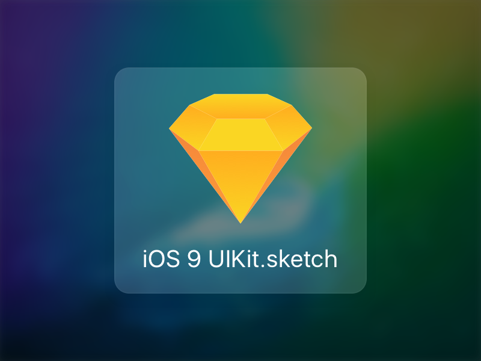

iOS 9b1 UIKit for Sketch
===========

Introducing the first most accurate and most complete iOS 9 UI template.

I will keep adding more goodies so [+Watch](https://github.com/philipamour/ios9-uikit/subscription "+Watch") this repo and [Follow Me on Twitter](https://twitter.com/philipamour "Follow Me on Twitter") to keep up to date.

## Features
- As pixel-perfect and accurate vector representation of the iOS 9b1 UI components as humanly possible
- Document structure that is easy to use and navigate through

## Components

##### Apps
- Settings - Root
- Photos - Moments
- Messages - Root
- Contacts - Root
- Music - Playback

##### UINavigationBar
- Dark & Light Version
- Realistic Blur
- Modals
- Hierarchical Navigation
- Segmented Controll
- Search Bar
- Safari Address Bar

##### UITabBar
- Dark & Light Version
- Realistic Blur

##### UIAlertController
- Alert Style
- ActionSheet Style
- Realistic Blur

##### UIActivityViewController
- Realistic Blur
- AirDrop examples

##### UITableView
- Disclosure, Detail, Subtitle, Icon, ...
- Edit Mode

##### Keyboard
- Dark & Light Version
- Realistic Blur

## How to Use
- Clone this repo
- Open the **iOS 9 UIKit.sketch**
- Design something awesome!

## Dependencies
Requires [Sketch](http://bohemiancoding.com/sketch/ "Sketch") and [San Francisco Font](https://developer.apple.com/fonts/ "San Francisco Font") 

===========
*If you find anything missing and would like it to be added, please [create a new issue](https://github.com/philipamour/ios9-uikit/issues/new "Create a New Issue") - that way, it will be easy for me to fullfil and keep track of requests.*

*Thanks a lot to [Bruno Martins](https://dribbble.com/brunus "Bruno Martins") (3D mockup, testing and feedback), [Ari](https://dribbble.com/ari "Ari") (testing and feedback) & [Louie Abreu](https://lmjabreu.com "Louie Abreu") (testing and feedback)*
